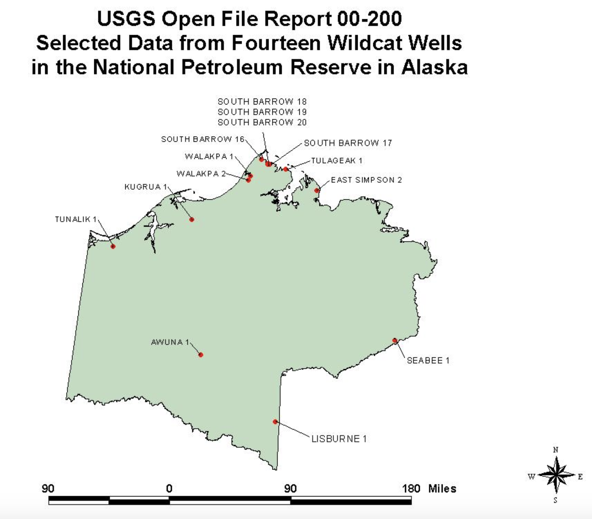

```{r setup, include=FALSE}
knitr::opts_chunk$set(echo = TRUE)
```

## Pendahuluan

Sebelumnya, saya ingin mengucapkan terima kasih atas sambutan yang (buat saya) lumayan hangat di LinkedIn atas tulisan pertama saya mengenai [_k-means clustering_ pada data log quad combo](https://www.linkedin.com/posts/aviandito_k-means-clustering-pada-data-well-log-activity-6616219568727777280-jq7i). Jadinya ketagihan nulis 'deh. Doakan semoga saya bisa nulis lebih banyak lagi tentang _data science_ dan _geoscience_ ya!

Kali ini saya akan membahas tentang _the dirty work_ dalam alur kerja analisis data, yaitu _data wrangling_. _Data wrangling_ adalah proses transformasi data 'mentah' menjadi format siap pakai dalam analisis. Banyak kesulitan yang umum ditemukan dalam tahapan ini, mulai dari jumlah file data mentah yang banyak, jenis _file_ yang beragam, hingga perbedaan format penulisan data. 

Umumnya proses ini menghabiskan waktu sekitar 70-80% dari keseluruhan jam kerja analisis data yang kita lakukan! Saya menghabiskan waktu beberapa hari untuk memuat dan merapikan data dari sumur South Barrow. Padahal, _clustering_ untuk tulisan pertama saya cuma membutuhkan beberapa jam kerja saja.

Dari penjabaran singkat ini, saya langsung punya saran untuk pengambil keputusan di perusahaan migas yang ingin memanfaatkan _big data_ (!!): sebelum merekrut _data scientist_, rekrut dulu tim _data engineer_ yang akan membuat _pipeline_ ETL _(Extract, Transform, Load)_ untuk semua data perusahaan, baik _stream_ maupun _batch_ data. Transformasi perusahaan Anda ke Era 4.0 (!!) sulit terjadi sebelum perusahaan memiliki _data warehouse_ yang rapi, siap pakai, dan mudah diakses. Karena tanpa data siap pakai, tidak akan ada analisis yang bisa dilakukan.

Tidak hanya untuk swasta, saya juga punya saran untuk Pemerintah 'nih. Menanggapi isu _open data_ E&P Indonesia, semoga data yang diunggah sudah "dirapikan" dan bukan hanya asal unggah. Sepengalaman saya, banyak data (terutama data lama) berupa _scan_ dan tidak bisa secara langsung dipakai dalam analisis. Inisiatif _open data_ harus kita apresiasi, tapi semoga datanya banyak yang "ramah komputer" ya Pak/Bu! Supaya bisa cepat dianalisis dan memberikan dampak dalam penelitian serta pengembangan hulu migas Indonesia.

Cukup pengenalannya, _let's get da wranglin' goin'._ Berikut adalah _package_ yang saya pakai dalam tulisan ini.

```{r, message=FALSE, warning=FALSE}
library(petroreadr)
library(scales)
library(tidyverse)
library(ggridges)
library(ggpubr)

# I particularly like theme_minimal's simplicity. This will make subsequent plots uses this theme
theme_set(theme_minimal())
# Use this if you hate the 1+e00.. scientific format in ggplot like i do
options(scipen = 9999)
```

## Memuat Data

Di tulisan ini, saya menggunakan dataset ["Selected Data from Fourteen Wildcat Wells in the National Petroleum Reserve in Alaska"](https://certmapper.cr.usgs.gov/data/PubArchives/OF00-200/WELLS/WELLIDX.HTM) yang saya gunakan di tulisan pertama. Dataset ini terdiri dari 14 sumur yang dibor dan diselesaikan di tahun 1980an, yang lokasinya ditunjukkan di gambar di bawah. Pada saat itu pemboran sumur-sumur _wildcat_ ini sepertinya disponsori oleh Pemerintah Amerika Serikat melalui USGS, yang kemungkinan besar bertujuan untuk menarik investor swasta untuk mengeksplorasi daerah yang dianggap _frontier_ di Amerika. Menarik, ya?

{width=60%}

Dalam tulisan ini, saya akan berusaha memuat dan 3 jenis data dari seluruh sumur tersebut, yaitu:

* Data log sumur;
* Data top formasi; dan
* Data porositas dan permeabilitas dari analisis _core_

Seorang bijak (kemungkinan besar Hadley Wickham dalam buku [R for Data Science](https://r4ds.had.co.nz/), tapi saya lupa) pernah berkata: "apabila kamu harus melakukan _copy-paste_ sebanyak tiga kali atau lebih, maka tulislah fungsi dan _looping_ untuk itu". Saya juga akan membuat fungsi dan _looping_ untuk membaca data dari banyak sumur sekaligus, sehingga kita tidak perlu memuat tiap file satu per satu. Menurut saya (selain kemampuan persuasi), fungsi dan _looping_ dalam kode adalah cara elegan dalam menyelesaikan permasalahan hidup, dan semoga Anda dapat merasakan hal yang sama!

Sebelum memulai, ada beberapa catatan mengenai dataset tersebut. Karena ketidaksempurnaan dalam digitalisasi, penyesuaian telah saya lakukan terhadap beberapa data asli supaya fungsi-fungsi dan _looping_ yang saya buat dapat bekerja di seluruh data. Ada juga data yang belum ditabulasi tetapi saya temukan di _scan_ laporan geologi, yang kemudian saya buatkan file `.csv`-nya. Jadi, _disclaimer_ singkat: *untuk mereplikasi secara sempurna, gunakan kode dan dataset yang saya unggah di [tautan GitHub berikut](https://github.com/aviandito/well-log-data-wrangling), ya.*

### Data Log Sumur

Memuat data log sumur adalah pekerjaan termudah dalam tulisan ini, karena kita dapat menggunakan fungsi `read_las()` dari package `petroreadr`. Namun sebenarnya, faktor terpenting dalam kemudahan memuat seluruh data log sumur adalah karena format log sudah terstandar dalam format LAS. Sehingga, satu fungsi yang kita buat dapat membaca file `.las` dari sumber manapun. Hal ini perlu menjadi catatan dalam digitalisasi data: kalau bisa, gunakan format terstandar sehingga file menjadi "ramah komputer".

Berikut adalah algoritma yang saya gunakan untuk membaca seluruh data log sumur:

1. Temukan semua nama file berekstensi `.las` dengan fungsi `list_file()`
2. Gunakan fungsi `read_las()` ke seluruh file tersebut (dalam `tidyverse` proses ini disebut "mapping", yang saya implementasikan dengan fungsi `map_df()`)

Sepertinya, saya berhasil memuat data seluruh sumur. Saya mengeceknya dengan menghitung jumlah sumur yang berhasil dimuat, dan mendapatkan 14 sumur sebagai hasil. Tugas pertama, selesai!

```{r}
# Batch read all well log data
# 1. Find all LAS files
alaska_well_log <- list.files(path = './well-data/',
                              pattern = '.las',
                              full.names = TRUE) %>% 
  # 2. Map read_las to all LAS files
  map_df(~read_las(.)) %>%
  na_if(-999) %>%
  as_tibble() %>%
  # standardize well name and depth column naming, as joins will be based on these fields
  rename(well_name = WELL,
         depth = M__DEPTH.FT)

# count distinct well name to check if we loaded all 14 well logs
alaska_well_log %>%
  distinct(well_name) %>%
  count()
```

### Data Top Formasi

Kita juga bisa menemukan data top formasi dalam dataset, namun sayangnya data tersebut berupa file teks (`.txt`) tidak terstruktur sehingga sulit untuk dibaca secara langsung oleh komputer. Di sini kreativitas kita diuji dalam melakukan pembacaan file tersebut. 

Dosen saya Pak Chalid pernah berujar: "tidak ada yang tidak mungkin di dunia ini kecuali mencium sikut sendiri". Menjadikan data teks menjadi dataframe terstruktur seharusnya bisa kita dilakukan...

Untuk melihat seperti apa bentuk dari file teks top formasi, saya menggunakan fungsi `read_lines`. Menariknya, ada pola-pola yang bisa kita gunakan untuk membaca file teks ini, misalnya tabel pencatatan dimulai dari baris `WELL NAME`. Selain itu, baris pencatatan berakhir sebelum kata-kata `Data Source`. 

```{r echo=FALSE}
read_lines('./well-data/SB16TOPS.TXT')
```

Dengan kebutuhan tersebut, saya menulis fungsi `alaska_tops_reader()`. Fungsi ini menerima nama file sebagai input, dan akan mengembalikan dataframe hasil pembacaan top formasi sebagai output. Berikut alur kerja fungsi tersebut:

1. Gunakan `read_table()` untuk membaca file mulai dari baris sebelum `WELL NAME`, hingga baris sebelum `Data Source`. Fungsi `grep()` adalah fungsi yang sangat _versatile_ dalam melakukan pencarian _string_ dan tersedia di berbagai bahasa pemrograman. Dalam kasus seperti ini, _`grep()` is your friend!_
2. Apabila pembacaan nama sumur terpisah, perbaiki. Serta buang kolom-kolom tidak penting
3. Lakukan standardisasi nama kolom

```{r}
# Create formation top reader function, with the txt filename as the input
alaska_tops_reader <- function(alaska_tops_file) {
  # 1. read text file and store into a df
  df <- read_table(alaska_tops_file,
                   # skips line until before "WELL NAME" column name
                   skip = grep('WELL NAME', read_lines(alaska_tops_file)) - 1,
                   # reads only up to line before "Data Source"
                   n_max = grep('Data Source', read_lines(alaska_tops_file)) - 1 - grep('WELL NAME', read_lines(alaska_tops_file)) - 1
                   ) 
  
  # 2. repair well name if it is separated into two columns, ...
  if('X2' %in% names(df)) {
    df <- df %>% 
      mutate(`WELL NAME` = paste(`WELL NAME`, X2)) %>%
      # ...drop all unimportant columns, ...
      select(-starts_with('X')) %>%
      select(1:3)
  } else {
    # ...else just drop all unimportant columns, ...
    df <- df %>% 
      select(-starts_with('X')) %>%
      select(1:3)
  }
  
  # 3. standardize column name
  names(df) <- c('well_name', 'formation', 'depth')
  
  # 3. return df
  df
}
```

Setelah itu, seperti halnya membaca data log, saya kembali menggunakan `map_df()` untuk menerapkan fungsi `alaska_tops_reader()` terhadap semua data top formasi. Di akhir proses, saya kembali melakukan penghitungan jumlah sumur dan rupanya saya berhasil memuat ke-14 sumur tersebut. Tugas kedua, selesai!

```{r, message=FALSE, warning=FALSE}
# Batch read all formation top data
alaska_top <- list.files(path = './well-data/',
                         pattern = 'TOPS.txt',
                         full.names = TRUE) %>% 
  map_df(~alaska_tops_reader(.)) %>%
  mutate(
    # standardizing well name from ALL CAPS to Title Case, similar with other data
    well_name = str_to_title(well_name),
    #  clean formation name for 'Surficial Deposits'
    formation = ifelse(grepl('Surficial Deposits', formation), 'Surficial Deposits', formation),
    #  clean formation name for 'East Simpson 2'
    well_name = ifelse(grepl('Eastern Simpson', well_name), 'East Simpson 2', well_name)
    ) %>%
  # manually load data for wells without tops TXT files, then bind into main top data
  bind_rows(read_csv('./well-data/AW1TOPS.csv'), read_csv('./well-data/LI1TOPS.csv'))

alaska_top %>%
  distinct(well_name) %>%
  count()
```

### Data Porositas dan Permeabilitas dari Analisis Core

Dibanding data lainnya, data porositas dan permeabilitas core menjadi yang paling sulit dibaca dalam dataset ini. Ada beberapa hal yang menyulitkan pembacaan, misalnya perbedaan jumlah dan urutan kolom dalam file berformat `.txt` ini (contohnya ada sumur yang tidak memiliki pembacaan porositas core, ada yang menuliskan dengan urutan porositas dulu baru permeabilitas, dll.). Selain itu, membaca nama sumur untuk kemudian ikut dimuat juga menjadi tantangan tersendiri.

Kesulitan lainnya adalah terdapat perbedaan cara penulisan kolom dalam file-file tersebut. Kebanyakan file menggunakan spasi sebagai pemisah antar kolom, seperti pembacaan dari sumur AW1 di bawah ini. Namun...

```{r echo=FALSE}
read_lines('./well-data/AW1PNP.TXT', skip = 10, n_max = 9)
```

... pada data sumur SB20 di bawah ini, pemisah antar kolom adalah _tab_ (bukan spasi), yang direpresentasikan dengan `\t`. Apabila di fungsi-fungsi sebelumnya saya menggunakan `read_table()`, untuk membaca file SB20, saya perlu menggunakan varian lain yaitu `read_table2()` yang lebih 'santai' dalam aturan mengenai pemisahan antar kolom.

```{r echo=FALSE}
read_lines('./well-data/SB20PNP.TXT', skip = 10, n_max = 9)
```

Penemuan ini menunjukkan bahwa konsistensi cara penulisan file sangatlah penting: perbedaan antara spasi atau _tab_ saja bisa membuat calon pemakai data pusing! Untuk data tabular seperti contoh-contoh ini, menurut saya format `.csv` dapat meminimalisir inkonsistensi, serta lebih mudah dalam pembacaan di berbagai aplikasi.

Tantangan lainnya, nama sumur juga menjadi salah satu hal yang perlu kita baca, dan kemungkinan besar salah satu solusi terbaik adalah dengan menggunakan _regular expression_ atau regex. Saya juga nggak ngerti-ngerti banget soal regex (Anda bisa menemukan banyak referensi untuk itu), dan disinilah Stack Overflow menjadi sahabat kita semua.

Dalam file-file ini, nama sumur selalu berada di antara string "Wildcat Well" dan "Permeability". Untungnya, saya menemukan cara menggunakan regex untuk mengambil string di antara dua string di Stack Overflow, yang kemudian saya gunakan dalam fungsi `str_extract()` untuk mengambil nama sumur.

```{r}
read_lines('./well-data/WA2PNP.TXT') %>%
  grep('Information', ., value = TRUE) %>%
  str_extract('(?<=Wildcat Well )(.*)(?= Permeability)')
```

Berbekal semua hal tersebut, saya menulis fungsi `alaska_pnp_reader()`. Saya menjadikan fungsi baca yang dipakai menjadi argumen, sehingga pengguna bisa memilih mau menggunakan `read_table2()` untuk membaca data seperti contoh SB20 di atas, atau `read_table()` untuk membaca data lainnya. Fungsi ini juga secara otomatis membaca nama sumur, kemudian membuat kolom baru berupa nama sumur supaya sama dengan format pembacaan log sumur dan top formasi sebelumnya.

```{r}
alaska_pnp_reader <- function(sbpnp_file, read_function = 'read_table') {
  
  # change read_table function used based on user's setting
  df = switch(read_function,
              read_table = read_table(sbpnp_file,
                   # skips line until before "feet" column name
                   skip = grep('feet', read_lines(sbpnp_file)) - 1,
                   # reads only up to line before "Data Source"
                   n_max = grep('Data Source', read_lines(sbpnp_file)) - 1 - grep('feet', read_lines(sbpnp_file)) - 2),
         
         read_table2 = read_table2(sbpnp_file,
                   # skips line until before "feet" column name
                   skip = grep('feet', read_lines(sbpnp_file)) - 1,
                   # reads only up to line before "Data Source"
                   n_max = grep('Data Source', read_lines(sbpnp_file)) - 1 - grep('feet', read_lines(sbpnp_file)) - 2)
         )
  
  # read well name. Regex used is case-by-case
  name <- read_lines(sbpnp_file) %>%
    grep('Information', ., value = TRUE) %>%
    str_extract('(?<=Wildcat Well )(.*)(?= Permeability)')
  
  # Return cleaned df and select only depth, porosity, and permeability. This is case-by-case
  df %>%
  rename(depth = feet,
         core_perm = millidarcies,
         core_poro = percent) %>%
  mutate(well_name = name,
         core_poro = core_poro / 100,
         core_perm = ifelse(grepl('<', core_perm), 0.001, core_perm)) %>%
  mutate(core_perm = as.double(core_perm)) %>%
  select(well_name, depth, core_perm, core_poro)
  
}
```

Untuk membaca, saya menggunakan pendekatan yang agak berbeda, untuk menunjukkan kepada Anda bahwa banyak jalan menuju ke Roma, apalagi dalam _coding_. Kalau sebelumnya saya menggunakan `map_df()` untuk melakukan _mapping_ fungsi pembaca pada seluruh file, kali ini saya menggunakan _the good ol' looping_ untuk melakukan pembacaan. Berikut adalah tahapan _looping_ yang saya lakukan:

* Buat variabel kosong `alaska_pnp` untuk menyimpan data hasil pembacaan
* Buat _list_ nama file porositas dan permeabilitas, yang saya simpan sebagai `pnp_list`
* Untuk semua elemen dalam `pnp_list`, masukkan nama file sebagai argumen fungsi `alaska_pnp_reader()`. Gunakan argumen `read_function = 'read_table2'` apabila nama file adalah SB20. Simpan hasil pembacaan dalam `alaska_pnp`
* Berhenti apabila semua elemen `pnp_list` sudah dibaca

Pakai `map_df()` atau _looping_, pendekatan mana yang benar? Menurut saya sih hal tersebut bergantung pada kasus yang kita punya. Tetapi kalau kata rekan saya [Muhammad Abduh](https://www.linkedin.com/in/mabdh/), seorang _computer scientist_ brilian dan berpengalaman, _coding is an art form_. Sehingga pada akhirnya semua adalah soal selera!

Setelah beberapa penyesuaian dan memuat data yang tidak ada file `.txt` nya, saya melakukan penghitungan jumlah sumur. Voila, terdapat 11 sumur yang berhasil terbaca, yang harusnya sesuai dengan ketersediaan data (CMIIW). Akhirnya semua tugas selesai!

```{r, message=FALSE, warning=FALSE}
# read poro & perm data
# create empty variable to store the readings
alaska_pnp = {}

# create a list that stores all filenames
pnp_list <- list.files(path = './well-data/', pattern = 'PNP.txt',full.names = TRUE)

# iterate all element in the list using for loop
for (i in 1:length(pnp_list)) {
  # if well name is SB20, use read_table2
  if(grepl('SB20', pnp_list[i])) {
    alaska_pnp <- rbind(alaska_pnp, alaska_pnp_reader(pnp_list[i], read_function = 'read_table2'))
  } else {
    # else just use default arguments
    alaska_pnp <- rbind(alaska_pnp, alaska_pnp_reader(pnp_list[i]))
  }
}

alaska_pnp <- alaska_pnp %>%
  # remove TL-1 porosity data as the function did not read core porosity
  mutate(core_poro = ifelse(well_name == 'Tunalik 1', NA, core_poro)) %>%
  # manually load data for wells without PNP TXT files, then bind into main top data
  bind_rows(read_csv('./well-data/SB16PNP.csv'))
  
alaska_pnp %>%
  distinct(well_name) %>%
  count()
```

## Menggabungkan Data Well Log, Top Formasi, dan Porositas-Permeabilitas

Sekarang kita sudah memiliki semua dataframe berisi pembacaan data log sumur (`alaska_well_log`), pembacaan top formasi (`alaska_top`), dan pembacaan porositas serta permeabilitas core (`alaska_pnp`). Terkadang analisis yang Anda lakukan membutuhkan dataset yang memiliki semua data tersebut di atas. Lalu bagaimana cara untuk menyatukan ketiga dataframe tersebut menjadi satu?

### Menggabungkan data dengan `join` 

Apabila Anda memiliki keinginan untuk menjadi analis data, maka Anda _wajib_ memahami `join` dalam _relational database_. Saya tidak akan membahas terlalu dalam soal `join` di sini, karena banyak artikel di internet yang membahas soal SQL Join. Intinya, `join` adalah cara "menggabungkan" beberapa tabel dalam sistem _relational database_. Gambar di bawah memberikan gambaran singkat mengenai apa itu `join` [(Sumber)](https://imgur.com/gallery/8u7fc/comment/1014933505).

{width=80%}

Tidyverse memiliki fungsi-fungsi `join` yang sangat mirip dengan SQL Join. Kalau sudah familiar dengan `join` di SQL, bagian ini akan sangat mudah dimengerti. Pada akhirnya saya menggunakan `full_join()` dan `left_join()` untuk menghasilkan integrasi data yang saya inginkan dari ketiga dataset tersebut.

```{r}
alaska_wildcat <- alaska_well_log %>%
  # 1a. join formation top data. Do full join to keep tops w/o log data, e.g. Torok Fm.
  full_join(alaska_top, by = c("well_name" = "well_name", "depth" = "depth")) %>%
  # 1b. fill formation data for all depths. Data needs to be rearranged first so the fill function works correctly
  arrange(well_name, depth) %>%
  fill(formation, depth) %>%
  # 2. join core poro & perm data. left join is enough
  left_join(alaska_pnp, by = c("well_name", "depth"))

alaska_wildcat %>%
  filter(well_name == 'South Barrow 16') %>%
  head()
```

Saya kemudian menuliskan dataset terintegrasi tersebut dalam format `.csv`. Apabila Anda tertarik untuk bermain-main dengan dataset yang saya muat, silakan diunduh dari [repositori GitHub berikut ini!](https://github.com/aviandito/well-log-data-wrangling)

```{r echo=FALSE}
write_csv(alaska_wildcat, 'alaska_wildcat.csv')
```

## Exploratory Data Analysis (EDA) Singkat, Kesimpulan, dan Saran

Sebetulnya masih banyak data yang belum saya muat namun penting dalam interpretasi geologi, seperti data _latlong_, saturasi air (Sw) core, dan lain-lain. Karena keterbatasan waktu, saya belum sempat mencoba memuat data-data tersebut. Apabila sempat, pasti akan saya muat dan perbaharui. Tetapi dengan data yang sudah saya muat, saya akan berusaha menunjukkan kesempatan-kesempatan analisis yang bisa dilakukan apabila kita memiliki data lengkap dan terintegrasi.

Kalau Anda memperhatikan budaya populer, Anda pasti tidak asing dengan album _Unknown Pleasure_ rilisan unit _post-punk_ legendaris _Joy Division_. Nah, _cover_ album tersebut terlihat seperti gelombang-gelombang seismik, dan R punya _package_ `ggridges` untuk memvisualisasikan data dengan gaya tersebut.

Plot di bawah ini menunjukkan visualisasi distribusi data log quad combo serta porositas dan permeabilitas core, berdasarkan formasi. Perhatikan bahwa saya menggunakan semua data yang saya muat dalam plot tersebut. Untuk kerapian plot, saya membatasi tiga formasi target utama di wilayah eksplorasi, yaitu Sag River Sandstone, Pebble Shale Unit, dan Kingak Shale.

Ada saja ide analisis lanjutan yang bisa kita tarik dari plot ini. Sekilas dapat dilihat bahwa hampir semua log di semua formasi memiliki distribusi dengan beberapa puncak. Kemungkinan besar hal tersebut terjadi karena formasi-formasi tersebut terdiri dari beberapa fasies. Dari sini, kita bisa menyarankan analisis lanjutan berupa _rock typing_ untuk karakterisasi reservoir yang lebih baik. Selain itu, dapat dilihat bahwa median porositas dan permeabilitas core di Pebble Shale Unit relatif lebih tinggi dibanding formasi lainnya. Apakah ini berarti kualitas reservoir di formasi tersebut lebih baik? Hal ini tentunya harus dijawab dengan analisis lanjutan.

```{r echo=FALSE, fig.width=10, message=FALSE, warning=FALSE}
alaska_data_ridge <- alaska_wildcat %>%
  gather(key = 'log', value = 'value', -c(well_name, depth, formation))

ridge_lin <- alaska_data_ridge %>%
  filter(formation %in% c('Sag River Sandstone', 'Pebble Shale Unit', 'Kingak Shale'),
         log %in% c('GR', 'NPHI', 'RHOB', 'DT', 'core_poro')) %>%
  ggplot(aes(y = formation, x = value)) +
  geom_density_ridges(quantile_lines = TRUE, quantiles = 2, rel_min_height = 0.01) +
  facet_wrap(~ log, scales = 'free_x', nrow = 1) +
  theme(legend.position = 'none') +
  labs(x = NULL,
       y = NULL,
       title = 'Distribusi Data Log Alaska Wildcat',
       subtitle = 'Garis vertikal menandakan median')

ridge_log <- alaska_data_ridge %>%
  filter(formation %in% c('Sag River Sandstone', 'Pebble Shale Unit', 'Kingak Shale'),
         log %in% c('LLS', 'LLD', 'core_perm')) %>%
  ggplot(aes(y = formation, x = value)) +
  geom_density_ridges(quantile_lines = TRUE, quantiles = 2, rel_min_height = 0.01) +
  facet_wrap(~ log, scales = 'free_x', nrow = 1) +
  scale_x_log10(breaks = trans_breaks("log10", function(x) 10^x),
                labels = trans_format("log10", math_format(10^.x))) +
  theme(legend.position = 'none') +
  labs(x = NULL,
       y = NULL)

ggarrange(ridge_lin, ridge_log, nrow = 2)
```

Sekarang lupakan _Joy Division_ dan mari kembali ke sahabat setia semua _log analyst_: _cross plot_. Di bawah ini, saya membuat cross plot porositas dan permeabilitas core berdasarkan formasi. Permeabilitas diplot dengan menggunakan skala logaritmik. Kemudian saya menambahkan garis regresi linear porositas terhadap permeabilitas. Terakhir, saya menggunakan warna untuk mengidentifikasi sumur asal data core tersebut.

Cross plot di bawah menunjukkan bahwa porositas dan permeabilitas berkorelasi positif, dan punya korelasi yang cukup kuat. Sepertinya, kita bisa membuat model prediksi permeabilitas yang cukup baik dari data yang kita punya.

Menariknya, hubungan antara porositas dan permeabilitas di Sag River Sandstone agak berbeda dibanding formasi lainnya. Apabila kita memperhatikan data Sag River Sandstone, dapat dilihat bahwa perbedaan gradien garis regresi tersebut kemungkinan disebabkan karena sekumpulan data dengan porositas relatif tinggi, namun permeabilitas relatif rendah (di kanan bawah garis regresi). 

Kita dapat mengidentifikasi bahwa data tersebut berasal dari suatu sumur, yaitu East Simpson 2 (ES-2), yang sepertinya harus kita pisahkan apabila kita menyiapkan dataset _training_ untuk model permeabilitas. Kalau melihat posisi ES-2 di peta persebaran sumur, memang agak terpisah di bagian paling timur dari sumur lainnya yang memiliki data core Sag River Sandstone. Apakah fasies Sag River Sandstone di ES-2 berbeda dengan sumur lainnya? Mungkinkah perbedaan ini dipengaruhi oleh struktur? Yang jelas hal tersebut membutuhkan penelitian lebih lanjut.

```{r echo=FALSE, fig.width=10}
# plotting core data...
alaska_wildcat %>%
  # filter for only non-null core porosity & permeability
  filter(!is.na(core_perm),
         !is.na(core_poro),
         formation %in% c('Sag River Sandstone', 'Pebble Shale Unit', 'Kingak Shale')) %>%
  ggplot(aes(x = core_poro, y = core_perm)) +
  geom_point(aes(color = well_name), alpha = 0.5) +
  geom_smooth(method = 'lm', se = FALSE, color = '#619CFF', size = 0.5, linetype = 'dotted') +
  scale_x_continuous(labels = percent) +
  # plotting permeability in log10 scale
  scale_y_log10(breaks = trans_breaks("log10", function(x) 10^x),
                labels = trans_format("log10", math_format(10^.x))) +
  annotation_logticks(sides = 'l') +
  stat_cor(aes(label = paste(..rr.label..)), label.x = 0.05) +
  facet_wrap(~ formation, ncol = 3) +
  theme(legend.position = "top",
        legend.title = element_blank(),
        panel.grid.major = element_blank(), 
        panel.grid.minor = element_blank()) +
  labs(title = 'Cross Plot Porositas - Permeabilitas Core Alaska Wildcat',
       x = 'Porositas (%)',
       y = 'Permeabilitas (mD)')
```

Sejujurnya _post_ kali ini cukup memakan waktu karena tantangan yang ada. Tetapi saya cukup menikmati proses penulisan fungsi yang bisa membaca banyak data migas sekaligus. Bagi saya hal tersebut cukup memuaskan! Dari pengalaman ini, saya memiliki beberapa saran, yaitu:

* Dalam digitasi data eksplorasi dan produksi, dibutuhkan _domain knowledge_ agar data terstruktur dengan baik
* Diperlukan standardisasi format penulisan data supaya data menjadi terstruktur dan lebih cepat diproses
* Gunakan format ramah komputer dalam mengunggah. Format `.las` untuk data well log serta `.csv` untuk tabulasi mudah dibaca
* Pembacaan _open data_ dari alamat web seperti contoh akan lebih efektif apabila menggunakan teknik _web scraping_, dibanding mengunduh file satu per satu seperti yang saya lakukan. [Beautiful Soup](https://www.crummy.com/software/BeautifulSoup/) yang ditulis dalam Python adalah tool yang baik untuk melakukan hal tersebut
* Untuk perusahaan migas: persingkat waktu dari pencarian data hingga analisis dengan memanfaatkan _cloud storage_ dan sistem _database_ (mungkin berbasis SQL?) yang mudah diakses siapapun dalam perusahaan melalui _software_ apapun
* Untuk Pemerintah: bayangkan kemungkinan yang bisa terjadi kalau data migas terbuka dan siap dianalisis. Penelitian hulu migas akan lebih banyak: model permeabilitas yang lebih akurat bisa ditemukan, identifikasi fluida lebih baik, dan lain-lain. Bahkan dampaknya bisa lebih luas daripada keilmuan geosains: pasar finansial bisa menjadi lebih efisien karena data migas yang terbuka, dan seterusnya!

Menemukan kesalahan dalam proses pemuatan data yang saya lakukan? Ada kritik mengenai fungsi yang saya tulis? Apakah saran yang saya sampaikan tidak mungkin dilakukan? Seperti biasa, komentar Anda sangat saya tunggu-tunggu dan mari berdiskusi!
